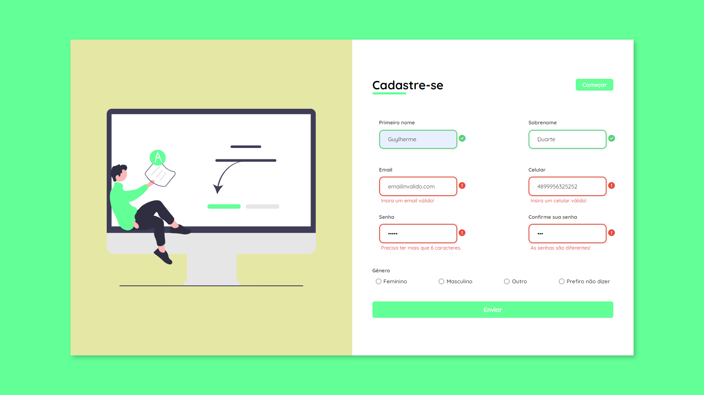

<h1 align="center"> Formulário com Validações </h1>

<!-- [🔗 Clique aqui para acessar](https://guylhermed.github.io/calendario-copa-do-mundo/) -->

## 💻 Projeto

Desenvolvido para estudo, este projeto demonstra uma página de cadastro de usuário com validações feitas através de JavaScript. Nele é possível simular um cadastro utilizando dados reais para verificar as validações feitas.

Através de funções e etruturas JavaScript foram possíveis desenvolver determinadas regras para serem feitas as validações e também mostrar mensagens de erro e/ou sucesso na tela do usuário.
Da mesma maneira foram manipulados alguns estilos do CSS via JavaScript.

---

## 🚀 Tecnologias

Esse projeto foi desenvolvido com as seguintes tecnologias:

- HTML
- CSS
- JavaScript
- Git e Github

---

## ✉️ Contato

guylherme_duarte@hotmail.com

